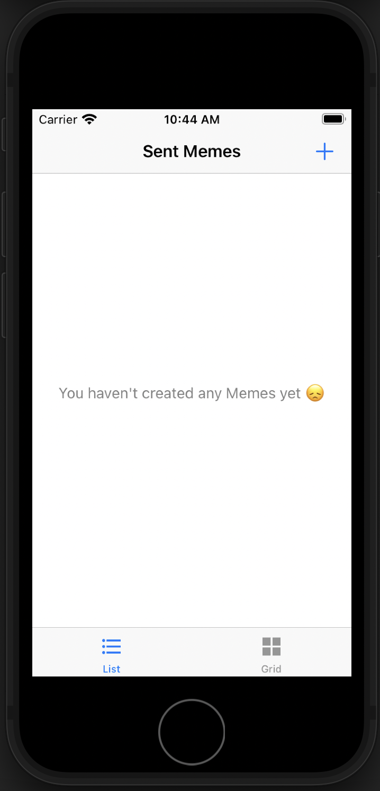
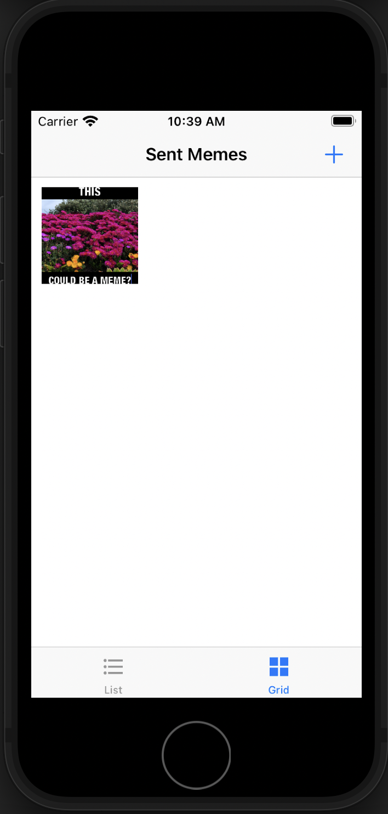
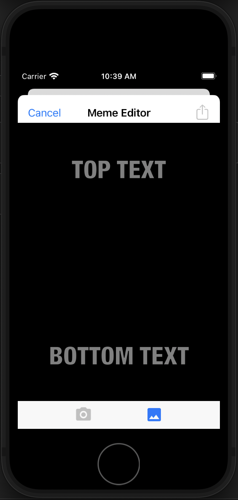
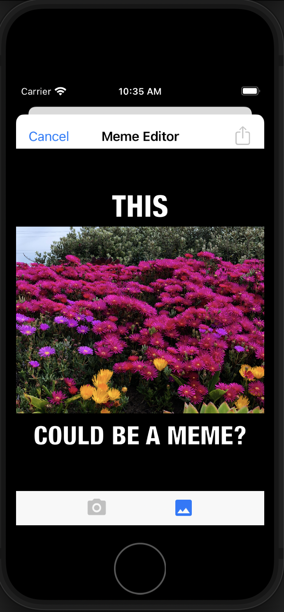

# MemeMaker - iOS App that creates memes from images

## Screenshots

#### Meme Collection
| Empty Screen | Collection | Table |
| ------------ | ---------- | ----- |
|  |  |  |

#### Meme Editor
| Empty | Editing |
| ----- | ------- |
|  |  |

## Frameworks Used
1. [Foundation](https://developer.apple.com/documentation/foundation)
2. [UIKit](https://developer.apple.com/documentation/uikit)

## How to Build
1. Download zip or fork & clone project on your desktop.
2. Open `MemeMe.xcodeproj` file in Xcode.

